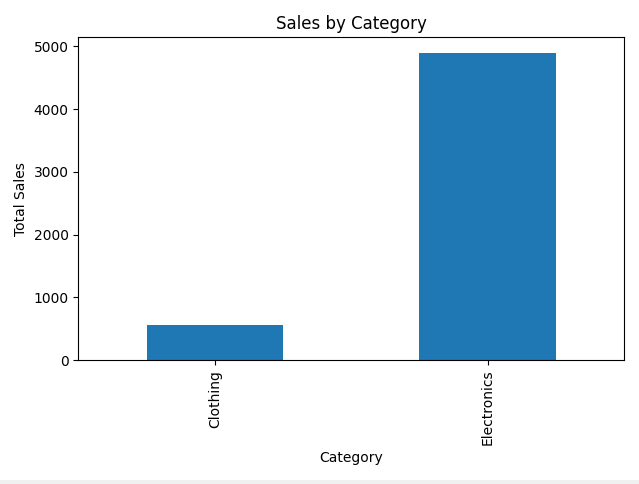

# 📊 Sales Analysis with Pandas

A simple data analysis project using Python, pandas, and matplotlib.

## Overview

This project analyzes a small sales dataset to extract useful insights such as total revenue, average pricing, and product performance.

## Features

* Calculate total sales
* Compute average product price
* Identify best-selling product
* Analyze sales by category
* Visualize results with a bar chart

## Tech Stack

* Python
* pandas
* matplotlib

## Project Structure

pandas-sales-analysis/

* sales.csv
* analysis.py
* README.md

## How to Run

Install dependencies:
pip install pandas matplotlib

Run the script:
python analysis.py

## Example Output

Total Sales: 5460
Average Price: 283.33

Best Selling Product:
Shirt (Clothing)

Sales by Category:
Clothing: 560
Electronics: 4900

## 📊 Visualization

